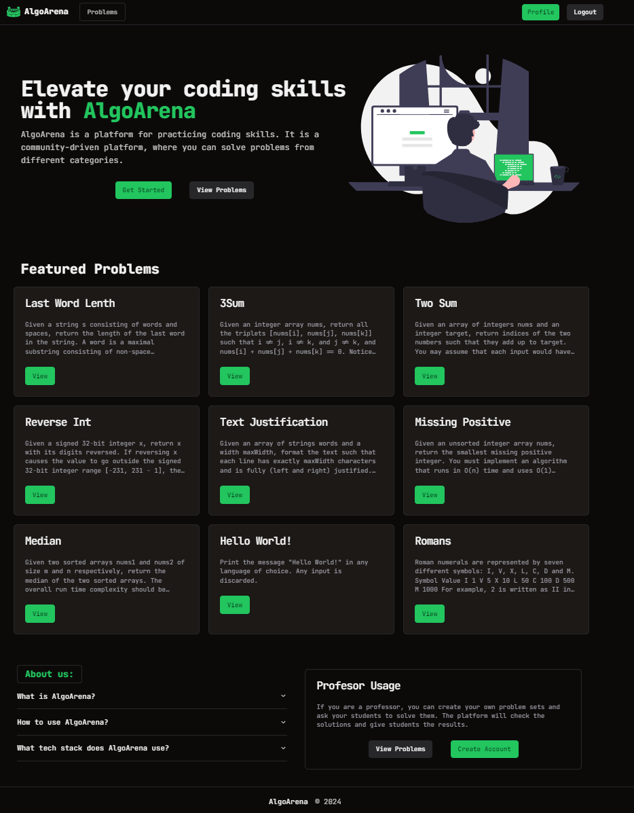
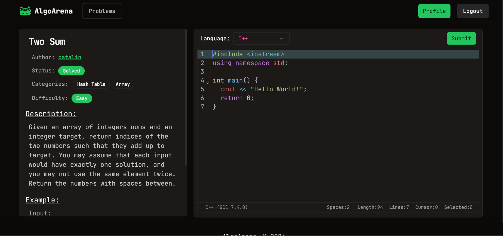
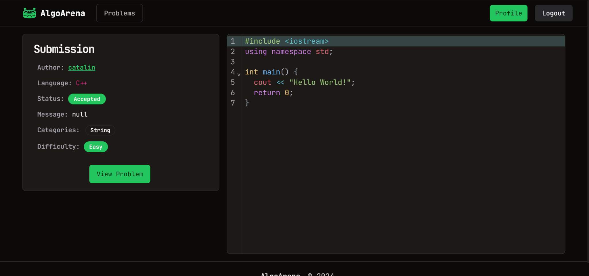
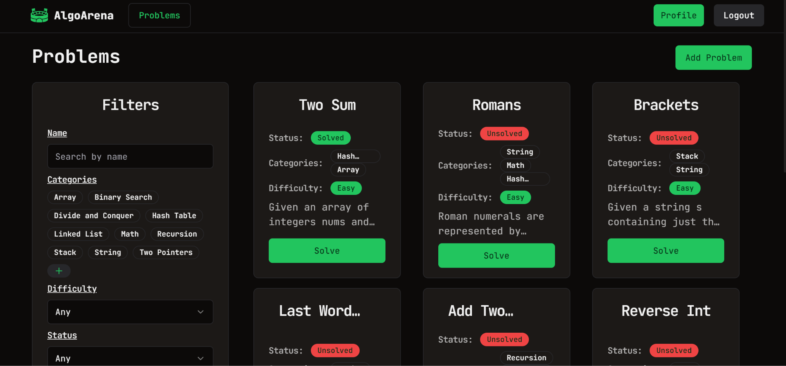
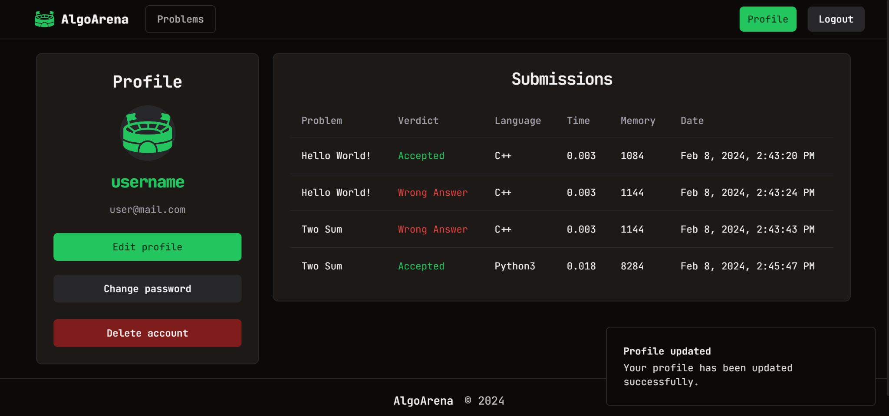

# AlgoArena Client

## Introduction

AlgoArena is a web platform for solving algorithmic problems. It is designed to help programmers to improve their coding skills by solving problems from the sphere of algorithms and computer programming. The platform is also intended to be used by teachers and professors as a tool for conducting classes on algorithms and programming.

The backend for this project can be found [here](https://github.com/24online24/algoarena-api).

## Features

- **Problem** - contains a description of the problem, sample test cases and a solution template
- **Submission** - contains a source code of the solution, a result of the compilation and a result of the execution
- **User** - contains a list of submissions and a list of solved problems

## Architecture

- **Frontend** - Vue3 + TypeScript + Vite
- **Backend** - Spring Boot + MySQL
- **Judge0** - Docker

## Screenshots

Landing page

Problem page

Submission page

Problems page

Profile page

